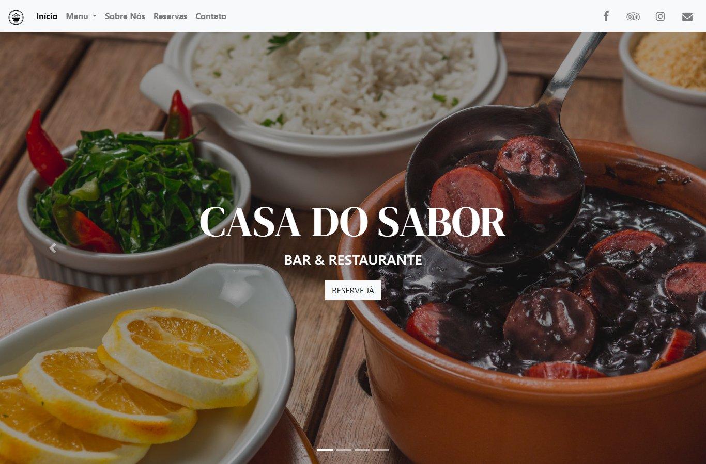

# Casa do Sabor

Site de demonstração de um restaurante fictício de cozinha brasileira, com várias
páginas: cardápio por categoria, eventos, depoimentos, reservas e contato. Faz parte
do meu portfólio de sites para restaurantes.

**Acesse o site:** https://fsckathy.github.io/restaurant-website-multipage/ 



## Páginas

| Página | Arquivo |
|---|---|
| Início (slider, cardápio, especiais e eventos, depoimentos) | `index.html` |
| Sobre | `pages/about.html` |
| Cardápio: pratos, sobremesas e bebidas | `pages/food.html`, `pages/desserts.html`, `pages/drinks.html` |
| Reservas | `pages/reservations.html` |
| Contato (com mapa) | `pages/contact.html` |

## Tecnologias

- HTML5 e CSS3
- Bootstrap 4
- jQuery
- Font Awesome 4.7
- animate.css (animações ao rolar a página)
- lazysizes (carregamento das imagens sob demanda)
- Google Fonts (DM Serif Display)

## Estrutura

```
├── index.html      página inicial
├── pages/          demais páginas
├── css/main.css    estilos do site (cores, fontes, layout)
├── js/             animações e scripts de cada página
└── media/          logo, favicons e fotos
```

## Como rodar localmente

Basta abrir o arquivo `index.html` no navegador. Não é preciso instalar nada.

## Pendências

- [x] Substituir as fotos, o logo e os ícones herdados do template original
- [ ] Substituir a foto de capa da página de reservas, que ainda vem do Cloudinary do autor original, por uma imagem própria em `media/`
- [x] Traduzir os textos para o português
- [x] Trocar o mapa do Google Maps pelo endereço do restaurante
- [x] Aplicar a identidade visual da Casa do Sabor (cores, logo e favicon)
- [x] Corrigir o menu no celular (botão de menu não aparece)
- [x] Corrigir o alinhamento do título do slider no celular

## Créditos

- Template base: [Grecko](https://github.com/PictureElement/grecko), de
  [Marios Sofokleous](https://www.msof.me/) (PictureElement), sob licença MIT.
- Adaptação e desenvolvimento: Katherine Costa.

## Licença

Código sob licença MIT. Veja o arquivo [LICENSE](LICENSE), que também lista as
bibliotecas de terceiros e as imagens que não são cobertas por essa licença.

O restaurante Casa do Sabor, os textos, os depoimentos e os dados de contato são
fictícios e usados apenas para demonstração.
